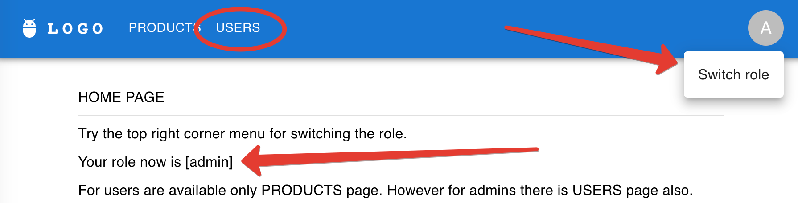
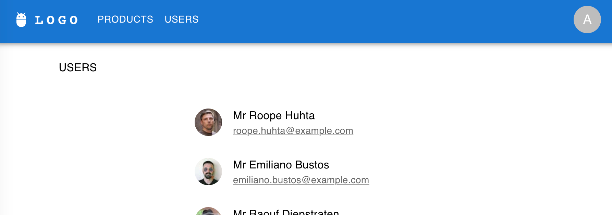
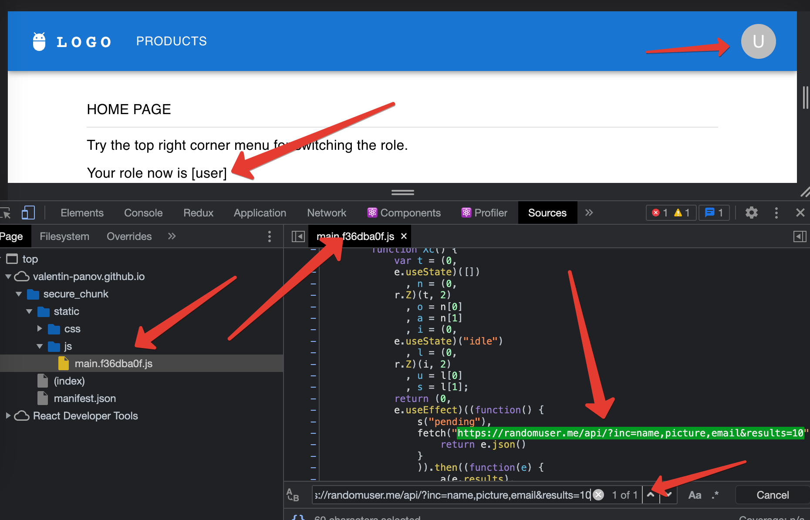
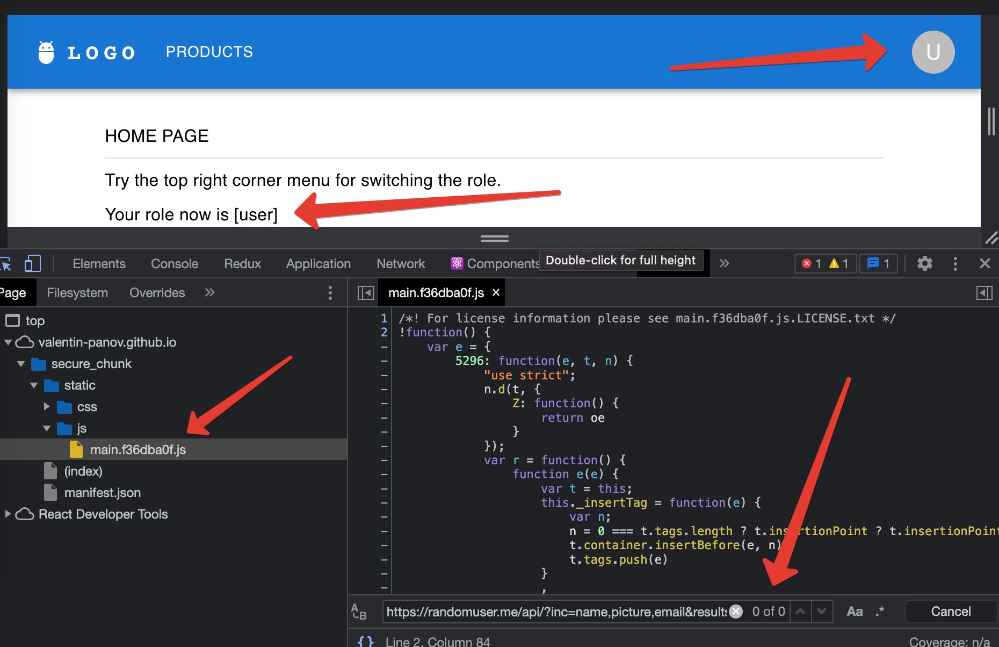

# Secure your chunks

[](https://ci.appveyor.com/project/vapanov/secure-chunk)

WEB VERSION: https://valentin-panov.github.io/secure_chunk/

Disclaimer. That article describes client-side protection only. That's obvious, that backend must not send data in
response to an unauthorised request.

The React SPA may protect routes in such a way that an unauthorised user will be redirected back to the home page from
the protected route, or the common page shows the protected information to authorised users only. But this approach may
contain something that might be considered as a security issue because the code that powers protected routes is still
loaded in the browser.

Let's dive in. The test application is located here, and its source code is here. The basic version is in the master
branch.

There is a menu in the top right corner where the role switcher is available. Try switching it. See the 'USER'
navigation link that appears and disappears depending on the user role.



Let's get the 'admin' role and visit the USERS page. We'll see that the users' personal data has been fetched and
presented on the page.



The responsible code is presented below (the snippet was shortened for clarity).

```javascript
export default function Users() {
    const [users, setUsers] = useState < IUser[] > ([]);

    useEffect(() => {
        fetch('https://randomuser.me/api/?inc=name,picture,email&results=10')
            .then((response) => response.json())
            .then((json) => {
                setUsers(json.results);
            })
            .catch();
    }, []);

    return (
        <>
            ...
            }
```

```javascript
import Users from "./components/Pages/Users/Users";

...

function App() {
    const {token} = useSelector((store: RootState) => store);

    return (
        <Routes>
            <Route path={BASE_URL}>
                <Route index element={<Home/>}></Route>
                <Route path="products" element={<Products/>}></Route>
                <Route
                    path="users"
                    element={
                        token === "admin" ? (
                            <Users/>
                        ) : (
                            <Navigate to={"/" + BASE_URL} replace/>
                        )
                    }
                ></Route>
                ...
```

Now switch the role to 'user' and we'll be redirected to the HOME page. Let's force reload the SPA from the origin. Then
open the Sources tab in DevTools and try to find our fetch request inside the source code delivered to the browser,
despite the 'admin' role wasn't granted.



That happens because usually the SPA delivers all the code first, and only then decides what to show or not.

It seems not to be a big deal if we do not store sensitive data inside our code. However, if there are some private API
keys or something alike, I think it's a really good idea to limit access to that data.

Fortunately, we can fix that really easily with React's lazy loading function. Lazy loading is when we split the
application up into different bundles. We can load the appropriate bundle at the appropriate time. In this case, that
would be when a certain route is loaded.

What we'll need to do here is to extract the component with the sensitive data from the bundle. Let's pull in the lazy
function that comes from React and wrap our protected component.

To do that, we would say const Users = lazy(). Lazy takes the callback which is then going to import the Users component
from the same spot as we used to.

That is generally all that's required to lazyLoad these routes. However, we do need to wrap our routes in Suspense,
because as they're loading, React may need to render something else as a fallback. That's pretty easy. We pull in
Suspense from React and wrap all our Routes with it.

```javascript
import React, {lazy, Suspense} from 'react';

...
const Users = lazy(() => import('./components/Pages/Users/Users'));
...

function App() {
    const {token} = useSelector((store: RootState) => store);
    return (
        <Suspense fallback={<CircularProgress color='inherit'/>}>
            <Routes>
                <Route path={BASE_URL}>
                    <Route index element={<Home/>}></Route>
                    <Route
                        path='users' element={
                        token === 'admin' ? (
                            <Users/>
                        ) : (
                            <Navigate to={'/' + BASE_URL} replace/>
                        )
                    }
                    ></Route>
                    ...
```

Now we'll come back over to our application. Let's give it one more refresh and look into our main bundle .js code. It
should be the case that we don't see anything related to our fetch example.



Again, once the code that powers our application gets to the user's browser, we lose control of what they might do with
it. Keeping certain portions of code away from users who shouldn't see it is a good practice. It has the additional
benefit of boosting the our application performance because our code bundle is going to be smaller.

This is the way.